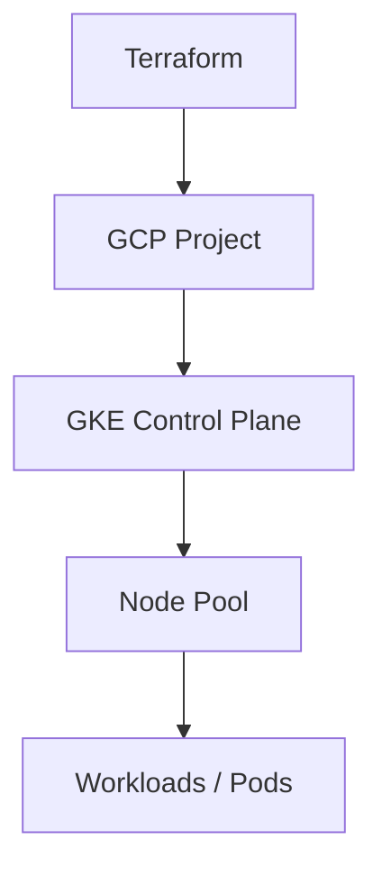

# 🚀 GKE Cluster with Terraform (Google Cloud)

Provision a production-ready Google Kubernetes Engine (GKE) cluster using Terraform.

This repository provides a minimal but extensible baseline for deploying Kubernetes infrastructure on GCP with Infrastructure as Code (IaC).

---

## 🧠 Use Case

- Quickly spin up a Kubernetes cluster on GCP
- Reproducible infrastructure for development or production
- Foundation for CI/CD, platform engineering, or microservices deployments

---

## 🏗 Architecture



Optional extensions:
- Cloud DNS
- Load Balancer / Ingress
- Monitoring (Prometheus / Grafana)
- CI/CD (GitHub Actions)

---

## ⚙️ Tech Stack

- **Terraform**
- **Google Cloud Platform (GCP)**
- **Google Kubernetes Engine (GKE)**
- **gcloud CLI**
- **kubectl**

---

## 📦 Features

- GKE cluster provisioning via Terraform
- Managed Kubernetes control plane
- Configurable node pools
- Ready for kubectl access
- Clean and simple baseline for further automation

---

## 🔐 Prerequisites

- Google Cloud account
- Billing enabled
- Project created

Install locally:

```bash
gcloud components install kubectl
```

Authenticate:

```bash
gcloud auth login
gcloud config set project <PROJECT_ID>
```

Enable required APIs:

```bash
gcloud services enable container.googleapis.com
gcloud services enable compute.googleapis.com
```

---

## 🚀 Quickstart

```bash
git clone https://github.com/joreichhardt/gke-cluster-terraform.git
cd gke-cluster-terraform

terraform init
terraform apply
```

After provisioning, configure kubectl:

```bash
gcloud container clusters get-credentials <CLUSTER_NAME> \
  --zone <ZONE> \
  --project <PROJECT_ID>
```

Verify cluster:

```bash
kubectl get nodes
```

---

## ⚙️ Configuration

Customize via variables (e.g. `terraform.tfvars`):

```hcl
project_id   = "your-project-id"
region       = "europe-west3"
cluster_name = "my-gke-cluster"
node_count   = 2
machine_type = "e2-medium"
```

---

## 💸 Cost Considerations

- GKE cluster management
- Compute Engine instances (node pool)
- Network egress costs

A minimal cluster typically costs around **20–50€/month**, depending on region, machine type, and usage.

---

## 🔐 Security Notes

- Use IAM roles instead of service account keys where possible
- Restrict API access with firewall rules
- Consider private clusters for production
- Enable Workload Identity for secure service access

---

## 🧠 Design Decisions

- Terraform for reproducibility and version control
- GKE for managed Kubernetes with lower operational overhead than self-managed clusters
- Simple baseline instead of an over-engineered setup

---

## 📈 Next Steps

- Deploy applications via Helm
- Integrate CI/CD with GitHub Actions
- Add monitoring with Prometheus and Grafana
- Use Terraform remote state with a GCS backend

---

## 🧹 Cleanup

Destroy all resources:

```bash
terraform destroy
```

---

## 👤 Author

Johannes Reichhardt  
DevOps / Platform Engineering / Infrastructure as Code

---

## ⭐ Why this repo?

This project is part of a broader effort to build **production-ready, reproducible cloud infrastructure** using modern DevOps practices.
